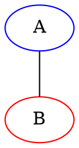
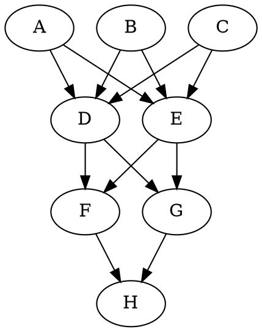

## Intro

A C++ parser for [the DOT language](https://graphviz.org/doc/info/lang.html), leveraging [the lexy parser](https://github.com/foonathan/lexy).

Requires C++ 17. 

## Language Nonconformities

These nonconformities mostly stem from the limitation of the lookahead functionality of the parser (and ofc my laziness).
### syntax
- subgraphs must be declared with the `subgraph` keyword
- non-subgraph statements listed in `graph`/`subgraph` must be separated by semicolons, newlines, or both
- each non-subgraph statement in `graph`/`subgraph` can take up **at most** one line, which means multi-line strings are not supported; subgraph statements can take multiple line with no problem
- multi-line comments must not share lines with actual statements, for example

- subgraph in edge statements not fully supported; for now we only support node lists (separated by whitespace or comma) in edge statements. For example, the following can be successfully parsed


- node compass not supported
- only one `attr_list` is allowed after each statement; for example, `vertex [color=b; size=5]` is okay, but `vertex [color=b][size=5]` is not (why would u want it anyway?)

### semantics
Inheritance rules for graph properties
```dot
graph {
    graph[loc=top] // loc=top is inherited by all
    subgraph sub {
        loc=bottom  // overriding loc 
        // however, loc=bottom will NOT be inherited by subgraphs of sub
        subgraph {
            // here, loc is still top
        }
    }
}
```